

  

<h1 align="center">Strimr</h1>

Strimr is a third-party Plex client built in Swift with a native interface for iPhone, iPad, and Apple TV.

## Key Features
- Server selection
- Profile selection (Plex Home)
- Seerr integration
- Customizable library visibility and navigation order
- Media browsing with hubs
- Search with filters for movies, shows, and episodes
- Rich media details
- Playback engines: VLC, MPV, and external Infuse (limited)
- Watch together
- Audio/subtitle track selection
- Resume playback
- Downloads with offline mode
- Skip intro and credits

## Download

  
  

## Screenshots

  
iPhone

  

    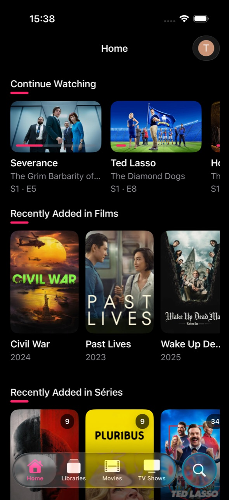
    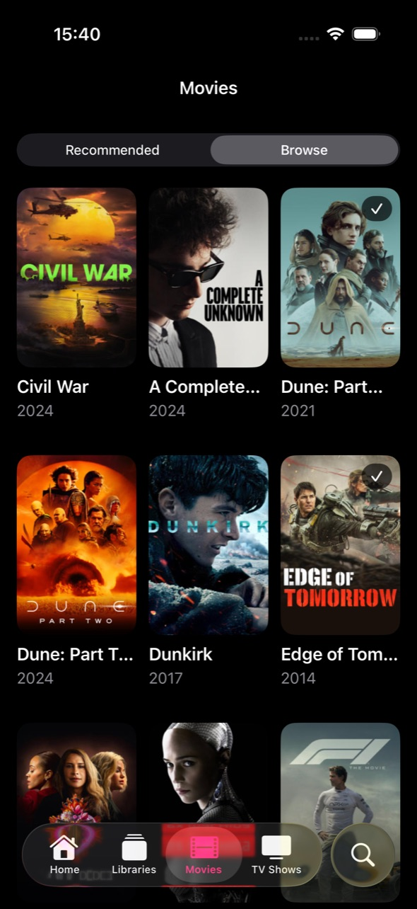
    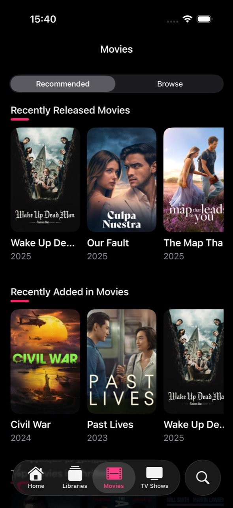
    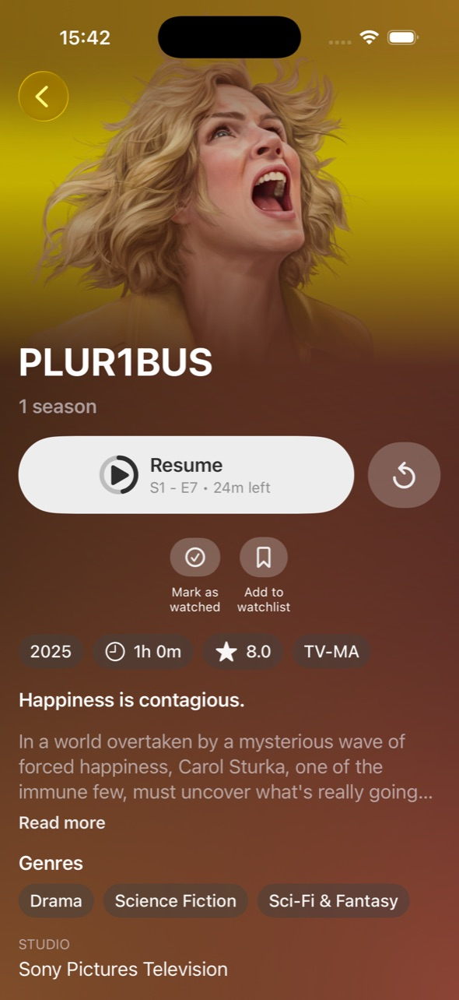
    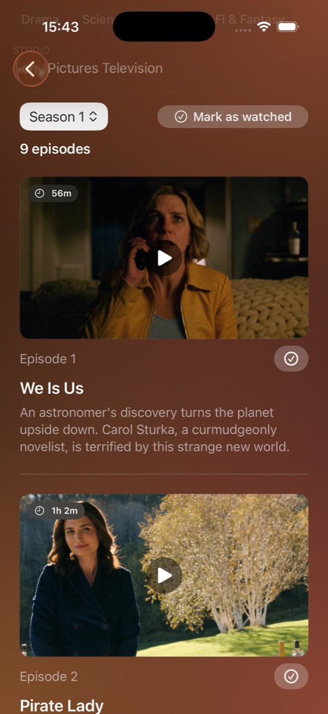
    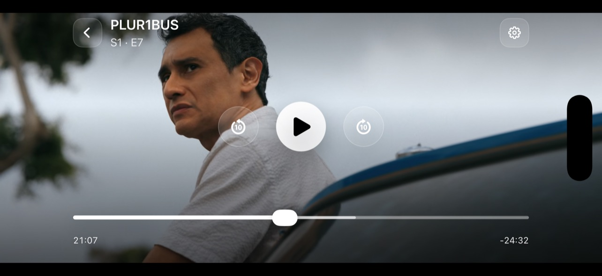
    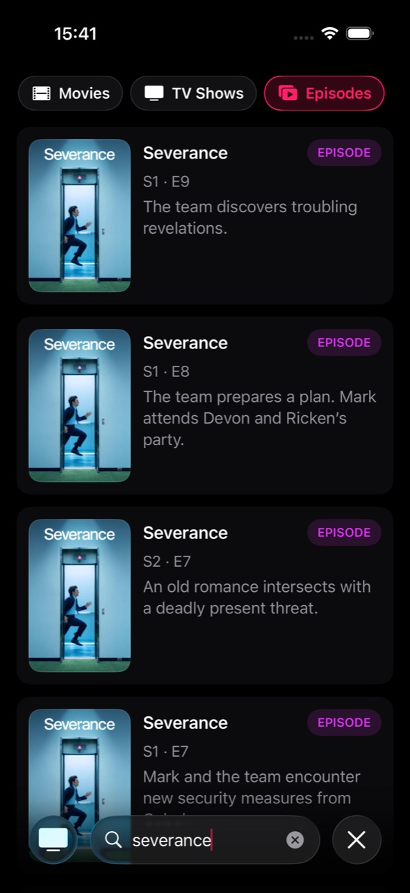
  

  
iPad

  

    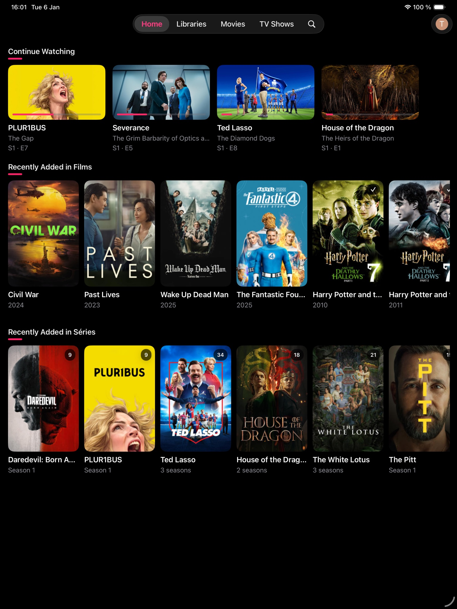
    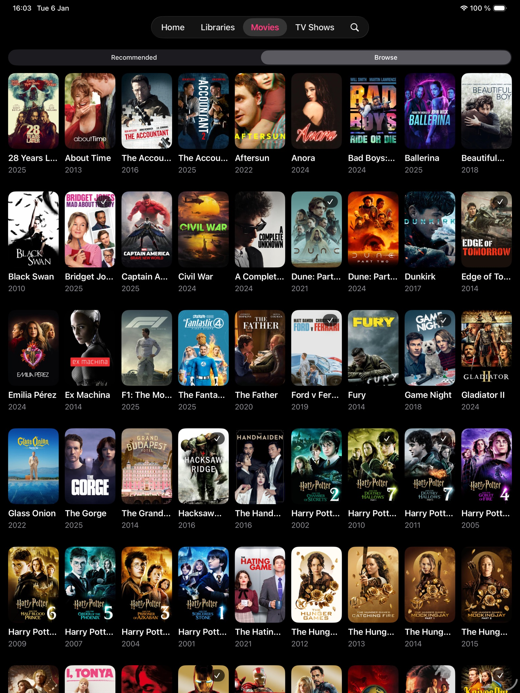
    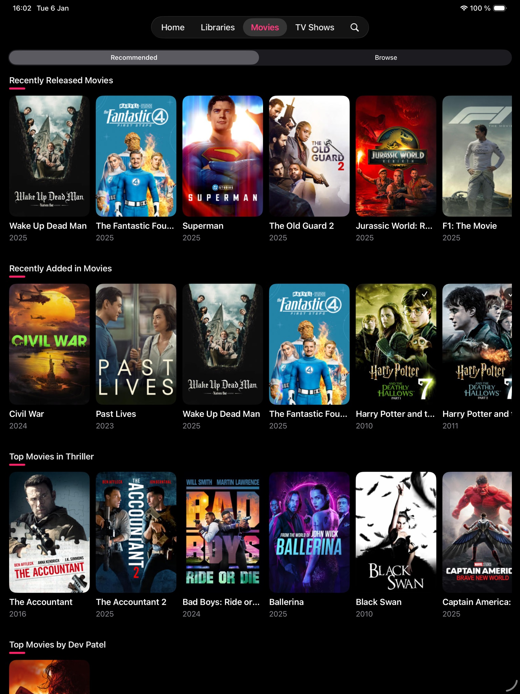
    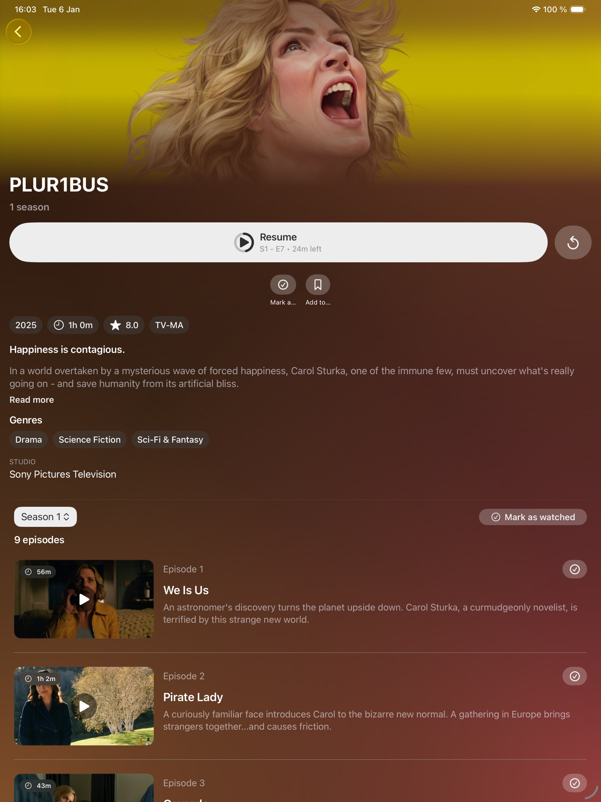
    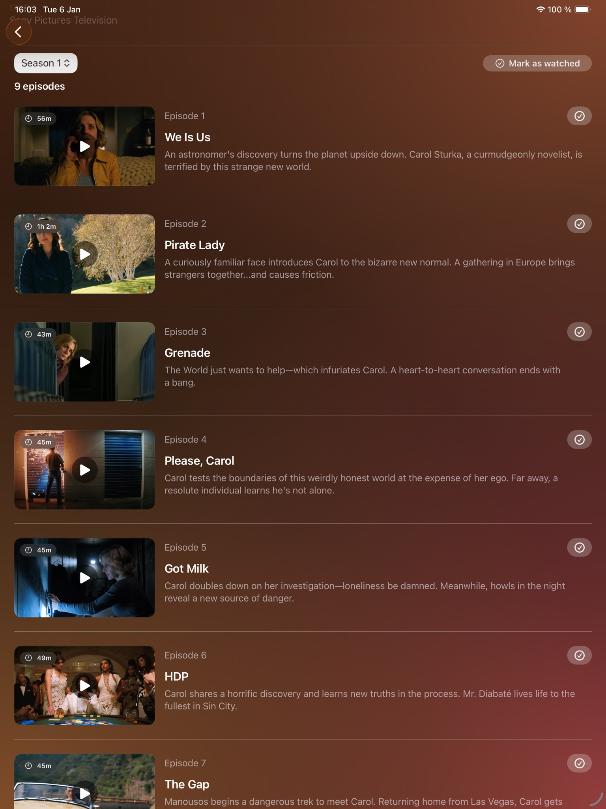
    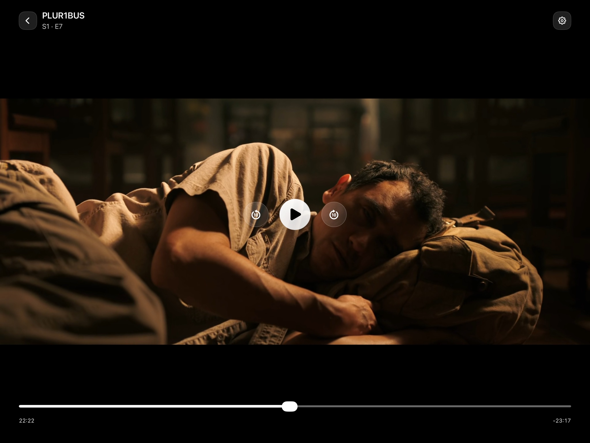
  

  
Apple TV

  

    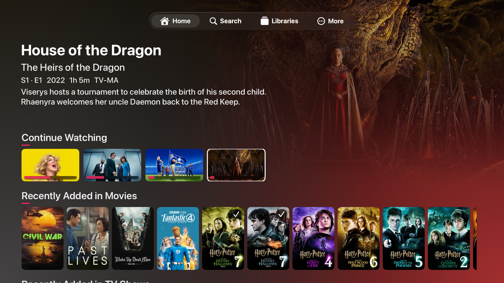
    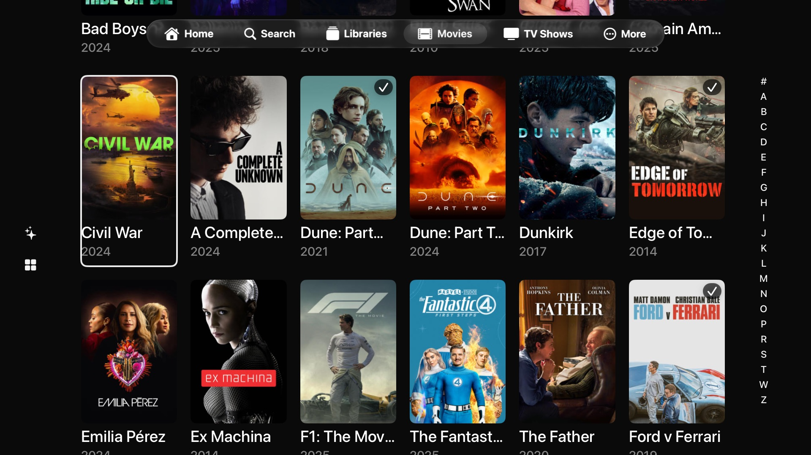
    
    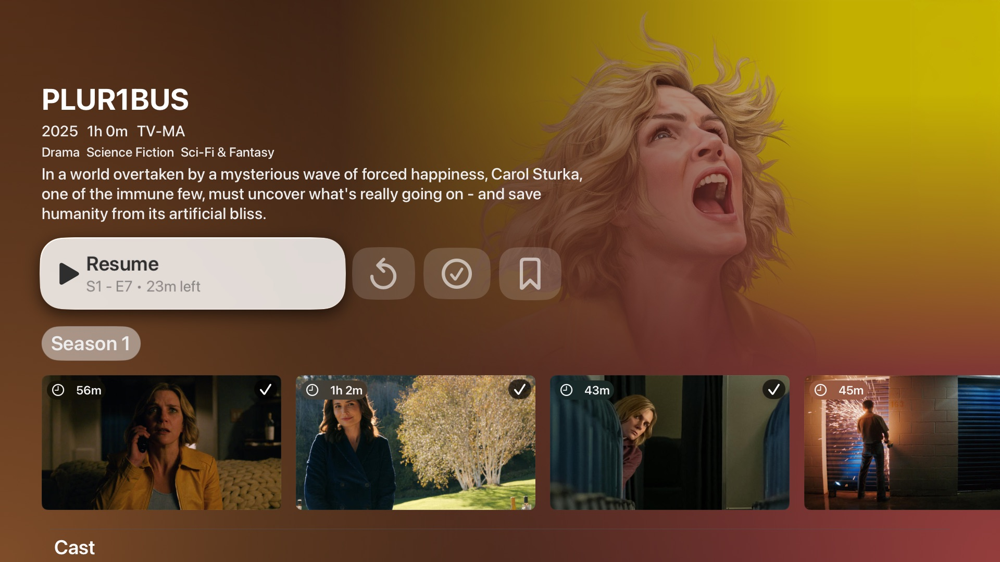
    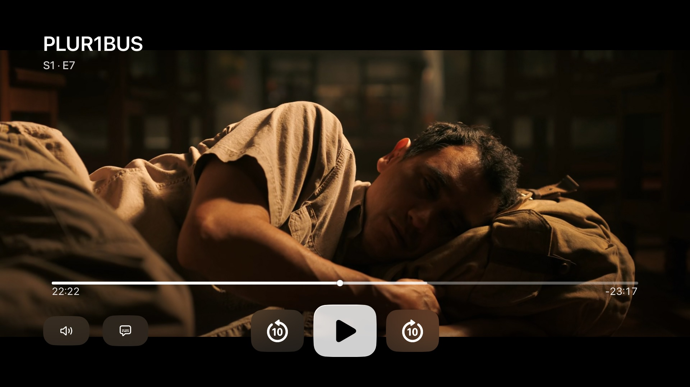
  

